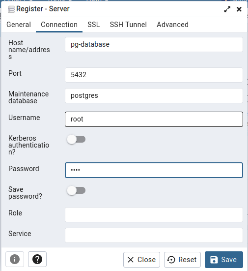
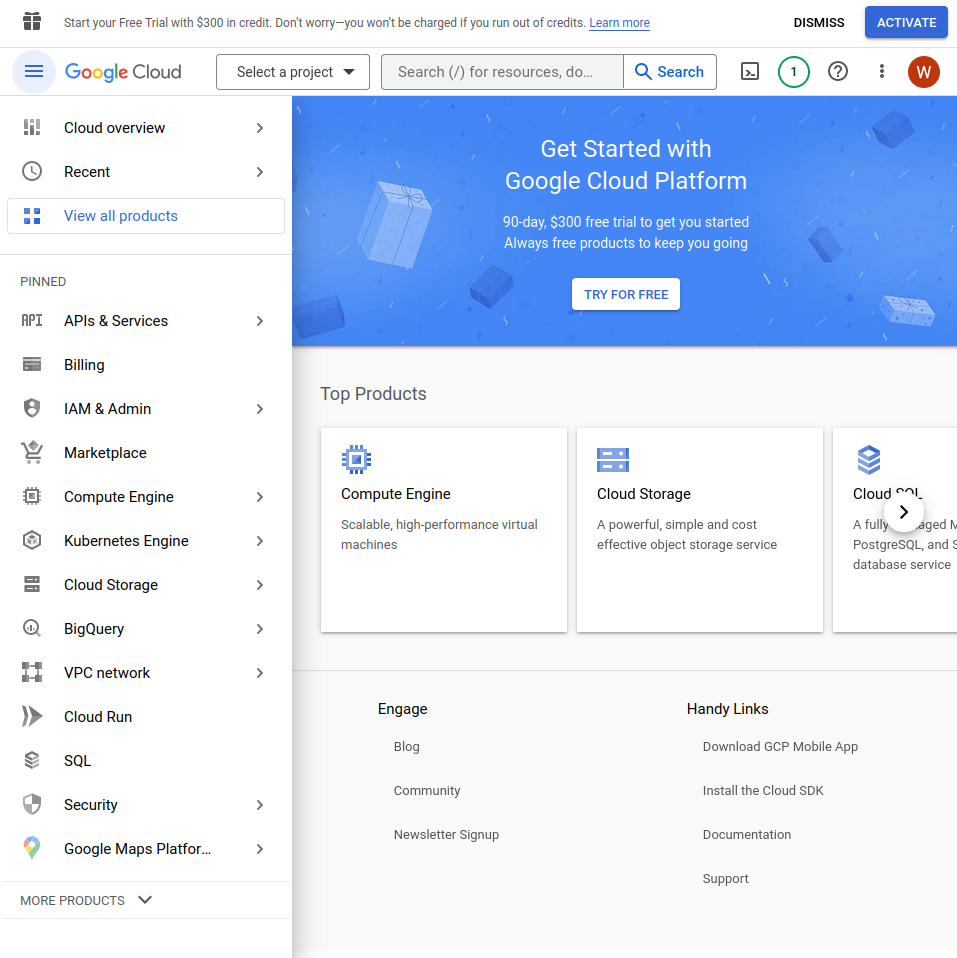
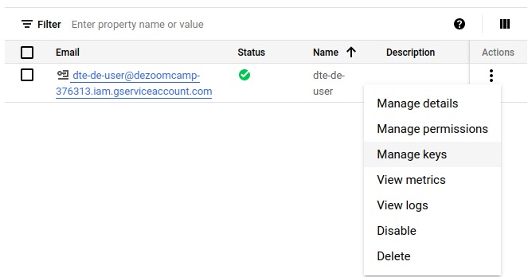

Week 1 Basic Docker-Postgres and GCP-Terraform
======================

> Next Week: [Workflow Orchestration](https://github.com/thisiswildanw/de_zoomcamp/tree/master/Week_2_Workflow_Orchestration)

> [Back to Start Page](https://github.com/thisiswildanw/de_zoomcamp)

Table of Contents: 
=================
- [Introduction to Data Engineering](#introduction-to-data-engineering)
- [Docker and Postgres](#docker-and-postgres)
    - [Introduction to Docker](#introduction-to-docker)
    - [Creating a Simple Data Pipeline using Python](#creating-a-simple-data-pipeline-in-docker)
    - [Ingesting NYC Taxi Data to Postgres with Python](#ingesting-nyc-taxi-data-to-postgres-with-python) 
    - [Connecting pgAdmin and Postgres with Docker](#connecting-pgadmin-and-postgres-with-docker)
    - [Putting Ingestion Script with Docker](#putting-ingestion-script-with-docker)
    - [Running Postgres and pgAdmin with Docker-Compose](#running-postgres-and-pgadmin-with-docker-compose)
    - [SQL refresher](#sql-refresher)
    - [Homework Part 1](#homework-part-1)
- [GCP and Terraform](#gcp-and-terraform)
    - [Introduction to Terraform](#introduction-to-terraform)
    - [Creating GCP Infrastructure with Terraform](#creating-gcp-infrastructure-with-terraform)
    - [Setting Up the Environment in Google Cloud](#setting-up-the-environment-in-google-cluod)
    - [Homework Part 2](#homework-part-2)


Introduction to Data Engineering
================================
[**Data Engineering**](hhttps://www.coursera.org/articles/what-does-a-data-engineer-do-and-how-do-i-become-one) is the practice of designing and building systems for collecting, storing, and analyzing data at scale. 


Docker and Postgres
===================

### Introduction to Docker

**Docker** is a software platform to create, deploy and manage virtualized application containers on server or cloud. In our case, we use docker to isolate our data pipelines. 

Why data engineers should we care about Docker: 
- Local experiments
- Integration test (CI/CD)
- Reproducibility
- Cloud deployment (GCP, AWS od Azure)
- Compatible with Spark and serverless application (AWS Lambda, Google Fuction)

>Note : Docker containers are ***stateless***: any changes done inside a container will **NOT** be saved when the container is killed and started again. This is an advantage because it allows us to restore any container to its initial state in a reproducible manner, but you will have to store data elsewhere if you need to do so; a common way to do so is with _volumes_.

### Creating a Simple Data Pipeline in Docker

**Data pipeline** is a fancy name of process service that gets in data and produces more data. 

Let's create an example pipeline. We will create a dummy `pipeline.py`. A python script that receives an input argument and prints it.

```python

#import library that we need 
import sys
import pandas as pd

#print arguments
print(sys.argv)

#argument 1 contain the actual first argument that we input/write
day = sys.argv[1]

#print sentence with the argument and print pandas version
print(f'job finished successfully for day = {day}')
print('pandas version = ', pd.__version__)

```

We can try running this script with `python pipeline.py <input_argument>`, and it print 3 lines as expected :
- `[pipeline.py, '<input_argument>`
- `job finished successfully for day = <input_argument>`
- `pandas version = '<pandas version on this local env>'`

The result : 

<p align="center">
  
  <p align="center"> Pipeline.py is Running Via Python3</p>
</p>


OK, let's try to containerize `Pipeline.py` via Docker image (`dockerfile`).

```docker
#Docker image that we will build
FROM python:3.9

#Set up our image by installing pandas (in this case)
RUN pip install pandas

#Copy the script to the conainer ("source file" "destination")
COPY pipeline.py pipeline.py

#Define what to do when the container runs
ENTRYPOINT ["python", "pipeline.py"]
```


Let's build the image by following this command:

```docker
docker build -t test:pandas .
```

<blockquote>
Note: 

- 'test' is the image name and 'pandas' its tag. 
- `pipeline.py` and `dockerfile` should in the same directory.
- The Docker commands should also be run from the same directory as these files.
</blockquote>

The Result:

<p align="center">
  
  <p align="center"> Test:Pandas Image was Builded Using Docker </p>
</p>

We can run the container and pass an argument to it with this command: 

```docker
docker run -it test:pandas <input argument>
```

The result:
<p align="center">
  
  <p align="center"> Pipeline.py is Running Via Docker Container</p>
</p>

_[back to the top](#table-of-contents)_

<br></br>

### Ingesting NYC Taxi Data to Postgres with Python

Before ingesting NYC Taxi Data, we need to know how to running Postgres in a container by following this command: 

```
docker run -it \
    -e POSTGRES_USER="root" \
    -e POSTGRES_PASSWORD="root" \
    -e POSTGRES_DB="ny_taxi" \
    -v $(pwd)/ny_taxi_postgres_data:/var/lib/postgresql/data \
    -p 5432:5432 \
    postgres:13
```
> Note : Containerized version of postgres doesn't require any building or installation steps. We only need provide few environtment variable, volume for storing data and port mapping. 

- There are 3 needed enviroment variables (`-e`): 
  - `POSTGRES_USER` : the username for logging into database.
  - `POSTGRES_PASSWORD` : the password for the database. 
  - `POSTGRES_DB` : the name that we will give to the database.
  >Note : Username and Password in this project are meant for testing. Please give more appropriate Username and Password for daily production. 

- `-v` points to the volume directory. The colon `:` separates the first part (path to the folder in the host computer) from the second part (path to the folder inside the container). Path names must be absolute. If you're in a UNIX-like system, you can use `($pwd)` to print local folder as a shortcut.
  >Note: This command will only work if you run it from a directory which contains the ny_taxi_postgres_data subdirectory we created above.

- `p` is for port mapping. We choice `5432` as default Postgres port and host for this project. 
- The last argument is the image name and tag. We run `postgres` image on its version `13`.  


<p align="center">
  
  <p align="center">Postgre is Running Via Docker Container</p>
</p>


Once container is running, open new terminal and log into our database using [`pgcli`](https://www.pgcli.com/) by following this command :

```docker
pgcli -h localhost -p 5432 -u root -d ny_taxi
```

- `-h` is the host. Since we runinng locally we can use localhost.
- `-p` is the port. We use `5432` as default postgres port for this project.
- `-u` is the username.
- `-d` is the database name.
>Note: Password is requested after running the command.


<p align="center">
  
  <p align="center">Using pgcli to Access a Postgre Database (ny_taxi)</p>
</p>

<br></br>

We have learned how to run postgre in a docker container. Next, we will use data from [NYC TLC Trip Record Data website](https://www.nyc.gov/site/tlc/about/tlc-trip-record-data.page), specifically [Yellow Taxi Trip Record Parquet file for January 2021](https://d37ci6vzurychx.cloudfront.net/trip-data/yellow_tripdata_2021-01.parquet) and ingest it to postgre database using Jupyter NoteBook.

<p align="center">
  
  <p align="center">Ingestion Process</p>
</p>

Here, summary of NYC Data ingestion process via Jupyter Notebook in this project:
- Download parquet data using following command: 
  ```
  wget https://d37ci6vzurychx.cloudfront.net/trip-data/yellow_tripdata_2021-01.parquet
  ```
- Import python libraries that we needed (like Pandas & SQLAlchemy). 
- Create Schema for Yellow Taxi Trip database 
- Test NY_taxi Connection using SQLAlchemy
- Batch Ingestion from Yellow Taxi Trip Parquet Data to NY_Taxi Database 
- Create SQL Query to Access Postgre via Jupyter Notebook

>Note: Follow this Jupyter Notebook [*link*](1_Code/2_Ingesting_NYC_Data_to_Postgres/explore_ingest_data.ipynb) for detailed guide. 

_[back to the top](#table-of-contents)_

<br></br>

### Connecting pgAdmin and Postgres with Docker 

`pgAdmin` is a web-based tool to access and manage database. Its possible to run pgAdmin as container along with Postgre container, but both containers will have to be in the same *virtual network* so they can connect each other. 

First, create a virtual Docker network `pg-network`:
```
docker network create pg-network 
```

Use `docker network ls` to show existed network. 

<p align="center">
  
  <p align="center">Existed Docker Network</p>
</p>

We will now re-run our Postgres container with the added network name and the container network name, so that the pgAdmin container can find it (we'll use `pg-database` for the container name):

```
docker run -it \
    -e POSTGRES_USER="root" \
    -e POSTGRES_PASSWORD="root" \
    -e POSTGRES_DB="ny_taxi" \
    -v $(pwd)/ny_taxi_postgres_data:/var/lib/postgresql/data \
    -p 5432:5432 \
    --network=pg-network \
    --name pg-database \
    postgres:13

```

Then, run pgAdmin container on another terminal:

```
docker run -it \
    -e PGADMIN_DEFAULT_EMAIL="admin@admin.com" \
    -e PGADMIN_DEFAULT_PASSWORD="root" \
    -p 8080:80 \
    --network=pg-network \
    --name pgadmin \
    dpage/pgadmin4
```
- The container needs 2 environment variables: a login email and a password. We use `admin@admin.com` and root in this example.
>Note : Username and Password in this project are meant for testing. Please give more appropriate Username and Password for daily production. 
- `pgAdmin` is a web app and its default port is `80`; we map it to `8080` in our localhost to avoid any possible conflicts.
- Just like with the Postgres container, we specify a network and a name. However, the name in this example isn't really necessary because there won't be any containers trying to access this particular container.
- The actual image name is `dpage/pgadmin4`.

We now able to load pgAdmin on a web browser by browsing to `localhost:8080`. Use the same email and password you used for running the container to log in.

<p align="center">
  
  <p align="center">pgAdmin Login Page</p>
</p>

Right-click on Servers on the left sidebar and select Register > Server...

<p align="center">
  
  <p align="center">Create Server</p>
</p>

Under *General* setting give the Server a name and under *Connection* add the same host name, user and password you used when running the container.

<p align="center">
  
  <p align="center">General Setting</p>
</p>

<p align="center">
  
  <p align="center">Connection Setting</p>
</p>

Click on **Save**. Now, we should connected to the database.

We will explore using pgAdmin in next lessons.

_[back to the top](#table-of-contents)_

<br></br>


### Putting Ingestion Script with Docker

First, we need to export our existed Jupyter Notebook [`explore_ingest_data.ipynb`](1_Code/4_Putting_Ingestion_Script_to_Docker/explore_ingest_data.ipynb) with this following command:

```
jupyter nbconvert --to=script explore_ingest_data.ipynb
```

Clean up the script by removing everything we don't need. We will also rename it to `ingest_data.py` and add a few modifications:

- Use argparse to handle the following command line arguments:
  - Username
  - Password
  - Host
  - Port
  - Database name
  - Table name
  - URL for the `parquet` file
- The engine we created for connecting to Postgres will be tweaked so that we pass the parameters and build the URL from them, like this: 
```
engine = create_engine(f'postgresql://{user}:{password}@{host}:{port}/{db}')
```
- We will also download `parquet` file using the provided URL argument.

You can check the python script `ingest_data.py` [here](1_Code/4_Putting_Ingestion_Script_to_Docker/ingest_data.py)

Let's test the script using this following command:
```
python3 ingest_data.py \
    --user=root \
    --password=root \
    --host=localhost \
    --port=5432 \
    --db=ny_taxi \
    --table_name=yellow_taxi_trips \
    --url="https://d37ci6vzurychx.cloudfront.net/trip-data/yellow_tripdata_2021-01.parquet"

```
<p align="center">
  
  <p align="center">Run ingest_data.py </p>
</p>


Back in pgAdmin, refresh the Tables and check that `yellow_taxi_trips` was created. You can also run a SQL query to check the contents:

```sql
SELECT
    COUNT(1)
FROM
    yellow_taxi_trips;
```

This query should return 1,369,769 rows

<p align="center">
  
  <p align="center">Query Result </p>
</p>

After script running successfully, we are now ready to dockerize `ingest_data.py` by modify [`dockerfile`]() image in previous lesson. 

```docker 
#Docker image that we will build
FROM python:3.9

#Set up our image by installing pandas (in this case)
RUN apt-get install wget
RUN pip install pandas sqlalchemy psycopg2-binary

#Copy the script to the conainer ("source file" "destination")
COPY ingest_data.py ingest_data.py

#Define what to do when the container runs
ENTRYPOINT ["python", "ingest_data.py"]
```
Then, let's build the image:

```
docker build -t yellow_taxi_ingest:v01 .
```

And run it:

```
docker run -it \
    --network=pg-network \
    yellow_taxi_ingest:v01 \
    --user=root \
    --password=root \
    --host=pg-database \
    --port=5432 \
    --db=ny_taxi \
    --table_name=yellow_taxi_trips \
    --url="https://d37ci6vzurychx.cloudfront.net/trip-data/yellow_tripdata_2021-01.parquet"

```
The Result: 

<p align="center">
  
  <p align="center">Containerized Ingestion</p>
</p>

<p align="center">
  
  <p align="center">Query Result</p>
</p>

- As expected, the query return 1,369,769 row size. 


_[back to the top](#table-of-contents)_

<br></br>


### Running Postgres and pgAdmin with Docker-Compose


Running Postgres and pgAdmin with Docker-Composee for pgAdmin to save its settings, so that we don't have to keep re-creating the connection to Postgres every time rerun the container. Make sure you create a `data_pgadmin` directory in your work folder where you run `docker-compose` from.

```
services:
  pgdatabase:
    image: postgres:13
    environment:
      - POSTGRES_USER=root
      - POSTGRES_PASSWORD=root
      - POSTGRES_DB=ny_taxi
    volumes:
      - "./ny_taxi_postgres_data:/var/lib/postgresql/data:rw"
    ports:
      - "5432:5432"
  pgadmin:
    image: dpage/pgadmin4
    environment:
      - PGADMIN_DEFAULT_EMAIL=admin@admin.com
      - PGADMIN_DEFAULT_PASSWORD=root
    volumes:
      - "./data_pgadmin:/var/lib/pgadmin"
    ports:
      - "8080:80"
```


- We don't have to specify a network because docker-compose takes care of it: every single container (or "service", as the file states) will run withing the same network and will be able to find each other according to their names (pgdatabase and pgadmin in this example).
- We've added a volume for pgAdmin to save its settings, so that you don't have to keep re-creating the connection to Postgres every time ypu rerun the container. Make sure you create a data_pgadmin directory in your work folder where you run docker-compose from.

- All other details from the `docker run` commands (environment variables, volumes and ports) are mentioned accordingly in the file following YAML syntax.

We can run Docker compose by running the following command from the same directory where `docker-compose.yaml` is found. Make sure that all previous containers aren't running anymore:

```bash
docker-compose up
```

>Note: this command asumes that the `ny_taxi_postgres_data` used for mounting the volume is in the same directory as `docker-compose.yaml`.

Since the settings for pgAdmin were stored within the container and we have killed the previous onem, we have to re-create the connection by following the steps [in this section](https://github.com/thisiswildanw/de_zoomcamp/tree/master/Week_1_Introduction#connecting-pgadmin-and-postgres-with-docker).

Press `Ctrl+C` in order to shut down the containers. The proper way of shutting them down is with this command:

```bash
docker-compose down
```

And if we want to run the containers again in the background rather than in the foreground (thus freeing up your terminal), we can run it in detached mode:

```bash
docker-compose up -d
```
_[back to the top](#table-of-contents)_

<br></br>


### SQL Refresher 
Below are a series of SQL query examples to remember how to querying SQL. There are two tables (`yellow_taxi_trips`) and (`zones`) that we're working on this section. 

#### 1 Select  first 100 rows in the  `yellow_taxi_trips` table.

<p align="center">
  
  <p align="center">Query Result</p>
</p>

#### 2 Select first 100 rows in the `yellow_taxi_trips` and `zones` tables with condition below.
- Give aliases to the `yellow_taxi_trips` and `zones` tables for easier access.
- Replace Ds inside `PULocationID` and `DOLocationID` with the actual zone IDs for pick ups and drop offs.
- Use double quotes (`" "`) to access column names with capital letters

<p align="center">
  
  <p align="center">Query Result</p>
</p>


#### 3 Select first 100 rows in the `yellow_taxi_trips` and `zones` tables with condition below.
- Select more specific columns (`tpep_pickup_datetime, tpep_dropoff_datetime, total_amount`) instead of complete columns.
- Use `JOIN` or `INNER JOIN` to display combinied columns.
- Use slash (`/`) to seperate `Borough` and `Zone` info in combinied columns.

<p align="center">
  
  <p align="center">Query Result</p>
</p>


#### 4 Select first 100 rows  in the `yellow_taxi_trips` whose pick up location is null with condition below.
- The specific columns : (`tpep_pickup_datetime, tpep_dropoff_datetime, total_amount, PULocationID, DOLocationID`)
- This query should return an empty list.

<p align="center">
  
  <p align="center">Query Result</p>
</p>


#### 5 Select first 100 rows in the `yellow_taxi_trips` whose drop off location ID does not appear in the `zones` table with condition below.

- This query should return an empty list


<p align="center">
  
  <p align="center">Query Result</p>
</p>


#### 6 Delete all rows in the `zones` table with `LocationID` of 142.

<p align="center">
  
  <p align="center">Query Result</p>
</p>

#### 7 Select first 100 rows in the `yellow_taxi_trips` and `zones` tables with condition below.
- Use `Left Join` to show all rows from the "left" part of the statement but only the rows from the "right" part that overlap with the "left" part, thus the name.

> Note : This join is useful if we deleted one of the LocationID rows like before. The inner join would omit some rows from the trips table, but this query will show all rows. However, since one ID is missing, the "virtual" columns we defined to transform location ID's to actual names will appear with empty strings if the query cannot find the location ID.

<p align="center">
  
  <p align="center">Query Result</p>
</p>

#### 8 Display first 100 rows and specific columns from `yellow_taxi_trips` with condition below.

- Specific columns : (`tpep_pickup_datetime, tpep_dropoff_datetime, total_amount`)
- Create new columns from trunctated `tpep_dropoff_datetime` and use `Day` as parameter to removes any smaller values (hours, minutes, seconds).

<p align="center">
  
  <p align="center">Query Result</p>
</p>


#### 9 Display first 100 rows and specific columns from `yellow_taxi_trips` with following condition below.

- Specific columns : (`tpep_pickup_datetime, tpep_dropoff_datetime, total_amount`)
- Create new columns called `day` from `tpep_pickup_datetime` with using `CAST` to convert `TIMESTAMP` type to `DATE`.

<p align="center">
  
  <p align="center">Query Result</p>
</p>


- Counts the amount of records in the trips table grouped by day.
- Display ascending order from earliest to lastest day.


<p align="center">
  
  <p align="center">Query Result</p>
</p>

- Include the drop off location column and we group by it.
>Note : Instead of having to repeat the same line in both the SELECT and GROUP BY parts, we can simply indicate the arguments we use after the SELECT keyword by order number. 

<p align="center">
  
  <p align="center">Query Result</p>
</p>

_[back to the top](#table-of-contents)_

<br></br>


### Homework Part 1

#### Question 1 : Knowing docker tags
#### Answer : `--iidfile string`
Run the command to get information on Docker

`docker --help`

Now run the command to get help on the `docker build` command

Which tag has the following text? - Write the image ID to the file

<p align="center">
  
</p>

#### Question 2 : Understanding docker first run
#### Answer : 3

Run docker with the `python:3.9` image in an interactive mode and the entrypoint of bash. Now check the python modules that are installed ( use pip list). How many python packages/modules are installed?


<p align="center">
  
</p>

#### Question 3 : Count Record
#### Answer : 20530

How many taxi trips were totally made on January 15?

Tip: started and finished on `2019-01-15`

Remember that `lpep_pickup_datetime` and `lpep_dropoff_datetime` columns are in the format timestamp (date and hour+min+sec) and not in date.

<p align="center">
  
</p>


#### Question 4 :  Largest trip for each day
#### Answer : 2019-01-15
Which was the day with the largest trip distance Use the pick up time for your calculations.


<p align="center">
  
</p>

#### Question 5. The number of passengers
#### Answer : 2: 1282 ; 3: 254
In 2019-01-01 how many trips had 2 and 3 passengers?
<p align="center">
  
</p>

#### Question 6. Largest tip
#### Answer : Long Island City / Queens Plaza

For the passengers picked up in the Astoria Zone which was the drop off zone that had the largest tip? We want the name of the zone, not the id.

Note: it's not a typo, it's tip , not trip

<p align="center">
  
</p>

_[back to the top](#table-of-contents)_

<br></br>

GCP and Terraform
==================

### Introduction to Terraform 
[Terraform](https://www.terraform.io
) is open-source IaC (Infrastructure as Code) tool by HashiCorp. As IaC, it possible to build, change and manage our infrastructure like cloud service (GCP, AWS, Azure, etc) as an additional software component. 

During this course we will use [Google Cloud Platform (GCP)](https://cloud.google.com)
as our cloud services provider.


### Creating GCP Infrastructure with Terraform

#### Initial Setup

- Sign up for GCP and get $300, 90-day free trial.
  <p align="center">
    
    <p align="center">GCP Dashboard</p>
  </p>
- Setup new project by following this step:
  - Click `Select a project` to setup a new project.  
  <p align="center">
    
  </p>
  - Fill first form with our project name (`dezoomcamp`) and select `Create`
  <p align="center">
    
  </p>

  - Write down the `Project ID` , we need it for next step. 

  <br>

- Setup a service account for this project and download the JSON authentication key files. 
  - Go to IAM (Identity and Access Management) > Service Accounts.
  
  <p align="center">
    
  </p>
  
  - Select `+ Create Service Account`, then provide a service account name. We will use `dtc-de-user`. Leave other fields with default values and click on `Create and Continue`.
  
  <p align="center">
    
  </p>
  
  - Grant viewer access for service account by click on `Basic` > `Viewer`. Then click `Done`
  
  <p align="center">
    
  </p>

  - With the service account created, click on the `3 dots` below `Actions` and select `Manage keys`.
  <p align="center">
    
  </p>

  - Select `Add Key`> `Create New Key`

  <p align="center">
    
  </p>

  - Select `JSON` and click `Create`. The files will be downloaded to your computer. Save them to a folder and write down the path.

  <p align="center">
    
  </p>

- Download the [GCP SDK](https://cloud.google.com/sdk/docs/quickstart) for local setup. Follow the instructions to install and connect to your account and project.

- Set the environment variable to point to the auth keys. 
  - The environment variable name is `GOOGLE_APPLICATION_CREDENTIALS`
  - The value for the variable is the path to the json authentication file you downloaded previously.
  - Check how to assign environment variables in your system and shell. In bash, the command should be: 
  `export GOOGLE_APPLICATION_CREDENTIALS="<path/to/authkeys>.json`
  -Refresh the token and verify the authentication with the GCP SDK: 
  `gcloud auth application-default login`

#### Setup GCP Access
We need to setup access first by assigning the `Storage Admin`, `Storage Object Admin`, `BigQuery Admin` and `Viewer` IAM roles to the `Service Account`, and then enable the `iam` and `iamcredentials APIs` for our project by following this step : 

- On the GCP Project `dashboard`, go to `IAM & Admin` > `IAM`
- Click the pencil next to the service account we just created.
- Add the following roles and click on Save afterwards: 
  - `Storage Admin`: for creating and managing buckets.
  - `Storage Object Admin`: for creating and managing objects within the buckets.
  - `BigQuery Admin`: for managing BigQuery resources and data.
  - `Viewer` : should already be present as a role.
- Enable APIs for the project (these are needed so that Terraform can interact with GCP): 
  - [Identity and Access Management (IAM) API](https://console.cloud.google.com/apis/library/iam.googleapis.com)
  - [IAM Service Account Credentials API](https://console.cloud.google.com/apis/library/iamcredentials.googleapis.com)

#### Setup Terraform Files
>Note: If you hasn't installed terraform yet, then follow this instructions [here](https://developer.hashicorp.com/terraform/tutorials/aws-get-started/install-cli)


- Setup `main.tf` is required to define the resources needed.  

  ```

  terraform {
    required_version = ">= 1.0"
    backend "local" {}  # Can change from "local" to "gcs" (for google) or "s3" (for aws), if you would like to preserve your tf-state online
    required_providers {
      google = {
        source  = "hashicorp/google"
      }
    }
  }

  provider "google" {
    project = var.project
    region = var.region
    // credentials = file(var.credentials)  # Use this if you do not want to set env-var GOOGLE_APPLICATION_CREDENTIALS
  }

  # Data Lake Bucket
  # Ref: https://registry.terraform.io/providers/hashicorp/google/latest/docs/resources/storage_bucket
  resource "google_storage_bucket" "data-lake-bucket" {
    name          = "${local.data_lake_bucket}_${var.project}" # Concatenating DL bucket & Project name for unique naming
    location      = var.region

    # Optional, but recommended settings:
    storage_class = var.storage_class
    uniform_bucket_level_access = true

    versioning {
      enabled     = true
    }

    lifecycle_rule {
      action {
        type = "Delete"
      }
      condition {
        age = 30  // days
      }
    }

    force_destroy = true
  }

  # DWH
  # Ref: https://registry.terraform.io/providers/hashicorp/google/latest/docs/resources/bigquery_dataset
  resource "google_bigquery_dataset" "dataset" {
    dataset_id = var.BQ_DATASET
    project    = var.project
    location   = var.region
  }

  ```

- Setup `variables.tf` is required to defines runtime arguments that will be passed to terraform. Default values can be defined in which case a run time argument is not required.

  ```
  locals {
    data_lake_bucket = "dtc_data_lake"
  }

  variable "project" {
    description = "Your GCP Project ID"
  }

  variable "region" {
    description = "Region for GCP resources. Choose as per your location: https://cloud.google.com/about/locations"
    default = "us-central1"
    type = string
  }

  variable "storage_class" {
    description = "Storage class type for your bucket. Check official docs for more info."
    default = "STANDARD"
  }

  variable "BQ_DATASET" {
    description = "BigQuery Dataset that raw data (from GCS) will be written to"
    type = string
    default = "trips_data_all"
  }
  ```
- Executions: 

```
# Refresh service-account's auth-token for this session
gcloud auth application-default login
```
```
# Initialize state file (.tfstate)
terraform init
```

```
# Check changes to new infra plan
terraform plan -var="project=<your-gcp-project-id>"
```
```
# Create new infra
terraform apply -var="project=<your-gcp-project-id>"
```
```
# Delete infra after your work, to avoid costs on any running services
terraform destroy
```

<blockquote>

There are a number of terraform commands that must be followed:
- `terraform init` : initialize your work directory by downloading the necessary providers/plugins.
- `terraform fmt (optional)`: formats your configuration files so that the format is consistent.
- `terraform validate (optional)`: returns a success message if the configuration is valid and no errors are apparent.
- `terraform plan` : creates a preview of the changes to be applied against a remote state, allowing you to review the changes before applying them.
- `terraform apply` : applies the changes to the infrastructure.
- `terraform destroy` : removes your stack from the infrastructure.

</blockquote>

### Setting Up the Environment in Google Cloud]
(Comming Soon)

### Homework Part 2
(Comming Soon)


_[back to the top](#table-of-contents)_

<br></br>
