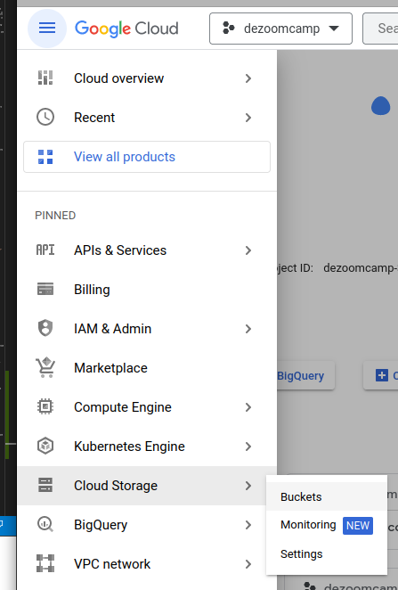

Week 2 Workflow Orchestration
=============================

> Next: (Comming Soon)

> Previous: [Week 1 Introduction](https://github.com/thisiswildanw/de_zoomcamp/tree/master/Week_1_Introduction)

> [Back to Start Page](https://github.com/thisiswildanw/de_zoomcamp)

Table of Contents: 
=================
- [Data Lake](#data-lake)
- [Introduction to Workflow Orchestration](#introduction-to-workflow-orchestration)
- [Introduction to Perfect Concepts](#introduction-to-perfect-concepts)
- [ETL with GCP & Perfect](#etl-with-gcp--perfect)
- [From Google Cloud Storage to Big Query](#from-google-cloud-storage-to-big-query)
- [Parameterizing Flow & Deployments with ETL Into GCS Flow](#parameterizing-flow--deployments-with-etl-into-gcs-flow)
- [Schedules & Docker Storage with Infrastructure](#schedules--docker-storage-with-infrastructure) 
- [Perfect Cloud/Additional Resource](#perfect-cloudadditional-resource)


Data Lake
=========

**Data lake** is a central repository that holds big data from many source & type of data (structured, semi-structured & unstructured). The main idea this concept is to ingest data *as quickly as* possible and *make it avalable* for many roles in organization.

_[back to the top](#table-of-contents)_

<br></br>

Introduction to Workflow Orchestration
======================================

**Workflow orchestration** means gouvering your *data flow* in way that respects orchestration rules and business logic. 

Now what is this **data flow**? 

**Data flow** is what binds and otherwise, *disparate set of application together*. So, workflow orchestration tools is allow you to turn any code into a workflow that can scheduled and observed. 

Here core feature of workflow orchestration:
- Remote execution.
- Scheduling.
- Retries.
- Caching.
- Integrated with external systems (APIs, databases).
- Support ad-hoc runs. 
- Allowing parameterization or alerting when something fails.

_[back to the top](#table-of-contents)_

<br></br>


Introduction to Perfect Concepts
================================
  
In this lesson, we use [**Prefect**](https:www.prefect.io) as workflow orchestration tool. 

Why **Prefect**?
- It's an *open-source* data flow platform.
- It allow you to add observability and orchestration using *Python* as code. 
- It let us build, run and monitor at scale. 

If you haven't installed **Prefect** yet, follow this [link](https://docs.prefect.io/getting-started/installation/)

<Blockquote>

We recommend this version to install: 
- prefect==2.7.7
- prefect-sqlalchemy==0.2.2
- prefect-gcp[cloud_storage]==0.2.3

</Blockquote>

If you have installed Perfect, Lets try it to orchestrate `ingest_data.py` on [previous](https://github.com/thisiswildanw/de_zoomcamp/tree/master/Week_1_Introduction#ingesting-nyc-taxi-data-to-postgres-with-python) lesson by following this step : 

1. Modify our `ingest_data.py`:
    -  First, split the ingestion process script into three function (`extract_data()` , `transform_data()` and `ingest_data()`). 
    -  Import new function: 
        - `prefect.task` : represents a discrate action in a Prefect workflow. 
        - `prefect.flow` : is a container for task. It represents an entire workflow or application by describing the dependencies between tasks. 
        - `prefect.tasks.task_input_hash` : required to for task caching. 
        - `datetime.timedelta` : required to calculating difference date in task caching.
        - `prefect_sqlalchemy.SqlAlchemyConnector` : required to create connection with databases.
    -  For `extract_data()` function, we modify it as Prefect task using `@task` with 4 parameter setting : 
        - `log_print` as `True` to enable the loggin of print task statements. 
        - `retries=3`. This tasks runs 3 times before the flow fails. 
        - `cache_key_fn=task_input_hash` to create specify the cache key function in task caching. Prefect task can be cached which case the outputs will be reused for future runs. For example, you might want to make sure that a database is loaded before generating reports, but you might not want to run the load task every time the flow is run. No problem: just cache the load task for 24 hours, and future runs will reuse its successful output.
        -  `cache_expiration=timedelta(days=1)` to set 1 day or 24 hours as expiration time in this task.
    
        Besides using Prefect to orchestrate and observe this task, there 3 main process in this script. First, we get file from url. Then, set file name by getting last `string` from splited url . Finally, read the `parquet` file and return it as `dataframe`. 

    -  `transform_data()` is new function in `ingest_data.py`. This function is required to remove and count all data with **zero passenger**. We also using `@task` to orchestrate and observe this function with parameter (`log_print`= `True` and `retries=3`).

    -   Create **Prefect Block** to store postgres configuration by following this step:
        - Run this command in terminal. 
            ``` prefect orion start ```
            <p align="center">
            
            </p>
            <br>

        - Check out the dashboard at `https://127.0.0.1:4200`.
            
            <p align="center">
            
            </p>
            <br>

        - Click `Hamburger Button` >  `Block` > `Add Block +`.
        - Select `SQLAlchemy Connector`.
            <p align="center">
            
            </p>
            <br>
        
        - Fill the `Block Name` form as "postgres-connector".
        - Click `SyncDriver`.
        - Select `postgre+psycopg2`.
        - Fill other form : 
            - `Database` : ny_taxi.
            - `Username` : root.
            - `Password` : root.
            - `Host`     : localhost.
            - `Port`     : 8080:80.
        - Keep empty for other `optional` form. 
        - Click `Create`.

            <p align="center">
            
            </p>
            <br>

        >Note : Username and Password in this project are meant for testing. Please give more appropriate Username and Password for daily production. 

    - After creating connection block, we can use it to simplify `ingest_data()` parameter using `SqlAlchemyConnector.load("postgres-connector")`. In addition fuction, we create `log_subflow` to print `table_name`.
    - In the end, we keep the rest of `ingest_data.py` functionally similiar with previous lesson. 
    - Here completed version of modified `ingest_data.py`: 

  ```python

    #Import libraries
    import os
    import argparse
    import pandas as pd
    import numpy as np
    from sqlalchemy import create_engine
    from time import time
    from datetime import timedelta
    from prefect import flow, task
    from prefect.tasks import task_input_hash
    from prefect_sqlalchemy import SqlAlchemyConnector

    @task(log_prints=True, retries=3, cache_key_fn=task_input_hash, cache_expiration=timedelta(days=1))
    def extract_data(url):
        #download parquet file
        os.system(f"wget {url}")

        #extract file_name
        #WARNING: script below is used only for this specific url
        file_name = url.split("/")[-1] 

        #read parquet using pandas
        df = pd.read_parquet(file_name)

        return df

    @task(log_prints=True)
    def transform_data(df):
        print(f"pre:missing passenger count: {df['passenger_count'].isin([0]).sum()}")
        df = df[df['passenger_count'] !=0]
        print(f"pre:missing passenger count: {df['passenger_count'].isin([0]).sum()}")
        return df


    @task(log_prints=True, retries=3)
    def ingest_data(table_name, df):
        #create engine using prefect_alchemy
        connection_block = SqlAlchemyConnector.load("postgres-connector")
        with connection_block.get_connection(begin=False) as engine:
            #try to create schema if exist, then replace it
            df.head(n=0).to_sql(name=table_name, con=engine, if_exists='replace')

            #create batch size using floor division
            batch_size = len(df) // 100000 
            
            #batch spliting dataframe
            list_df = np.array_split(df, batch_size)

            #Create batch ingestion
            for i in range(batch_size):
                try:
                    t_start = time()
                    list_df[i].to_sql(name=table_name, con=engine, if_exists='append')
                    t_end = time()
                    j =i+1
                    print('Batch data no-' + str(j) +' inserted to database, it took %.3f second' % (t_end - t_start))
                except StopIteration:
                    print("Ingestion Failed!")

    @flow(name="Subflow", log_prints=True)
    def log_subflow(table_name:str):
        print("Logging Subflow for: {table_name}")

    @flow(name="Ingest Flow")
    def main_flow(): 
        table_name = "yellow_taxi_data"
        url="https://d37ci6vzurychx.cloudfront.net/trip-data/yellow_tripdata_2021-01.parquet"

        log_subflow(table_name)
        raw_data = extract_data(url)
        data = transform_data(raw_data)
        ingest_data(table_name, data)

    if __name__ == '__main__':
        main_flow()
        
  ```
  <br>

2. Run modified `ingest_data.py` using following this command

   ``` python ingest_data.py ```
    
    <p align="center">
    
    </p>
    <br>


3. Lets check in pgAdmin. It shouldn't have data with zero passenger. 

    
    <p align="center">
    
    </p>
    <br>

4. Then, check how many data *more than* zero passenger. Its **1,244,691** row.

    <p align="center">
    
    </p>
    <br>

5. In the end, check the flow run in Prefect UI. Well, `ingest_flow` take 21 minutes to complete, while `sub_flow` almost near 0 minutes. 
    <p align="center">
    
    </p>
    <br>

_[back to the top](#table-of-contents)_

<br></br>


ETL with GCP & Perfect
======================

In this lesson, we will try to implement ETL (extract, transform, load) process to Google Cloud (Storage) using Python & Prefect by following this step:

1. Intstall required libraries on [requirements.txt](/Week_2_Workflow_Orchestration/1_Code/3_ETL_GCP_Prefect/requirements.txt) using `pip install -r requirements.txt`.

2. Run Prefect on terminal using `prefect orion start`. Dont forget to check out Prefect dashboard at `https://127.0.0.1:4200`.

3. Open VScode or another code editor. We will using `Python` as basic programming language. 

4. Create new python tab, and name it as `etl_web_to_gcs.py`. 

5. Import required function: 

    ```python
    from pathlib import
    import pandas as pd
    from prefect import flow, task
    from prefect_gcp.cloud_storage import GcsBucket
    ```

6. Create Prefect `task` to get dataset from repositories, then read and return it as `dataframe`.
    In this lesson, we are using Januray 2021 NYC Yellow Taxi data with (`.csv`) format from [Data Engineering Zoomcamp repository](https://github.com/DataTalksClub/nyc-tlc-data). 
    
    The url : ```https://github.com/DataTalksClub/nyc-tlc-data/releases/download/yellow/yellow_tripdata_2021-01.csv.gz```

    Python code:
    ```python
    @task(retries=3)
    def get_data(url:str):
        df = pd.read_csv()
        return df 
    ```

7. Create Prefect `task` to fix data types issue of `tpep_pickup_datetime` and `tpep_dropoff_datetime"`columns, then return it as cleaned `dataframe`. 

    Python code:
    ```python
    @task()
    def clean(df = pd.DataFrame):
        df["tpep_pickup_datetime"] = pd.to_datetime(df["tpep_pickup_datetime"] )
        df["tpep_dropoff_datetime"] = pd.to_datetime(df["tpep_pickup_datetime"] )
        return df
    ```

8. Create Prefect `task` to export our cleaned `dataframe` and write it to `.parquet` file and store it to our local storage.

9. Setting up Google Cloud Storage. 
    - Go to ```concole.cloud.google.com```.
    - Click `Navigation Bar` (The Hamburger Icon), Click `Cloud Storage` > `Bucket`.
    <p align="center">
    
    </p>
    <br>

    - Select `+ Create`, if you dont have any cloud buckets.
        - Fill the first form with your bucket name, we choice `prefect-test-de`
        - Keep it default for the rest form.
        - Click `CREATE`. 

        <p align="center">
        
        </p>
        <br>


10. Access configuration. We have created  `google service account` on [previous lesson](#introduction-to-perfect-concepts). Let use it. 

    >Note : Make sure that you have given `Biguery Admin`, `Storage Admin` role permission to your `service account`. 

12. GCS Bucket Block configuration on Prefect UI. 
    Lets make a block: 
    - Check out the dashboard at `https://127.0.0.1:4200`.
    - Click `Navigation Bar` (The Hamburger Button), then click `Blocks` > `+`.
    - Find `GCS Bucket` on search form. Click `Add +`.
    - Fill first form with your block name. 
    - Name the scond form with your bucket name. 
    - On GCP Credentials menu, copy-paste all your `service account` information as `dictionaries` to `service account info` form. 
    - Keep the rest empty, then click `Create`.
        <p align="center">
        
        </p>
        <br>

13. Create Prefect `task` to upload `parquet` file to Google Cloud Storage.
    Python code:
    ```Python
    @task()
    def write_gcs(path):
        gcs_block = GcsBucket.load("prefect-gcs")
        gcs_block.upload_from_path(
            from_path=f"{path}",
            to_path=path
    )
    ```

14. Combine all task and create Prefect flow using `@flow` as main function `etl_web_gcs()` . 
    
    Python code:
    ```Python

    @flow(log_prints=True)
    def etl_web_to_gcs():
        color   = "yellow"
        year    = 2021
        month   = 1
        dataset_file=f"{color}_tripdata_{year}-{month:02}"
        dataset_url= f"https://github.com/DataTalksClub/nyc-tlc-data/releases/download/{color}/{dataset_file}.csv.gz"
        
        df = get_data(dataset_url)
        cleaned_df = clean(df)
        path = write_local(cleaned_df, color, dataset_file)
        write_gcs(path)
    
    if __name__ == "__main__":
    etl_web_to_gcs()
    ```

15. Execute [`etl_web_to_gcs.py`](/Week_2_Workflow_Orchestration/1_Code/3_ETL_GCP_Prefect/etl_web_to_gcs.py) by following this command : `python etl_web_to_gcs.py`.

    <p align="center">
    
    </p>
    <br>

16. Check the result on cloud bucket below. The `parquet` file was **successfully** uploaded to GCS via Prefect & Python. 

    <p align="center">
    
    
    </p>

_[back to the top](#table-of-contents)_

<br></br>

From Google Cloud Storage to Big Query 
======================================

Parameterizing Flow & Deployments with ETL into GCS Flow 
========================================================

Schedules & Docker Storage with Infrastructure
===============================================

Perfect Cloud/Additional Resource
=================================